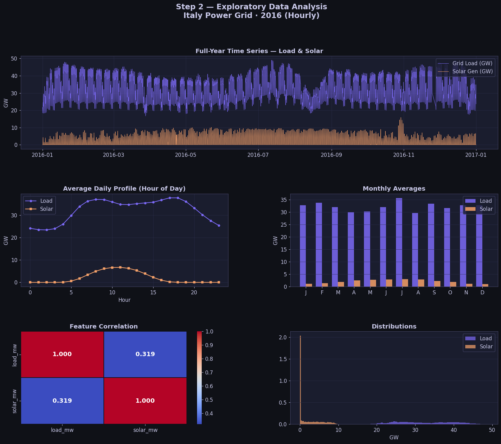
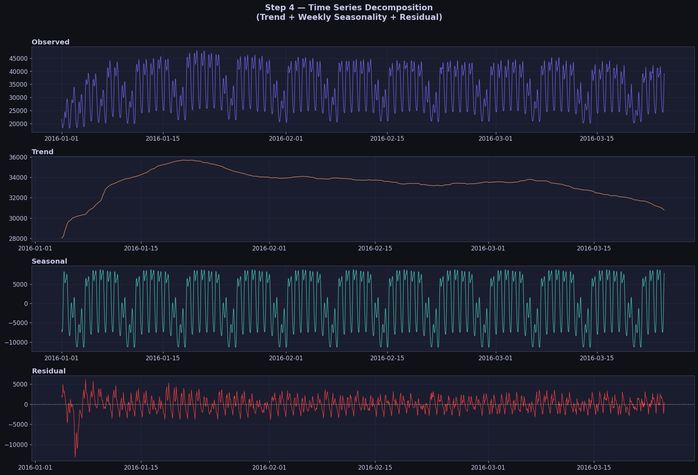
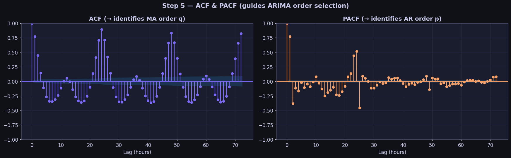
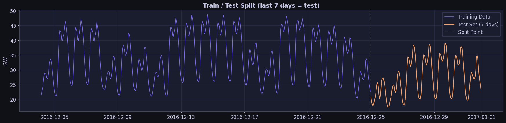
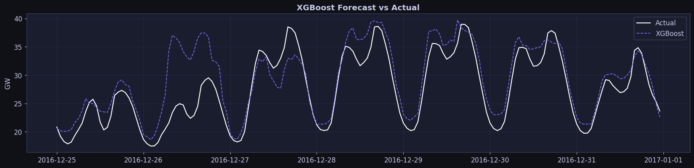
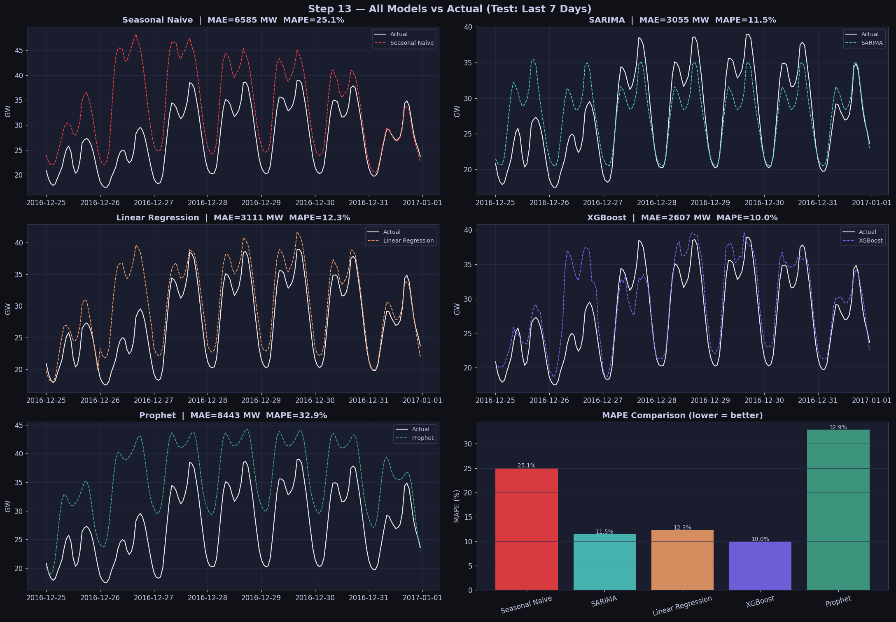
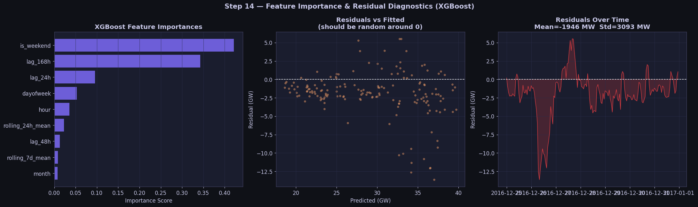
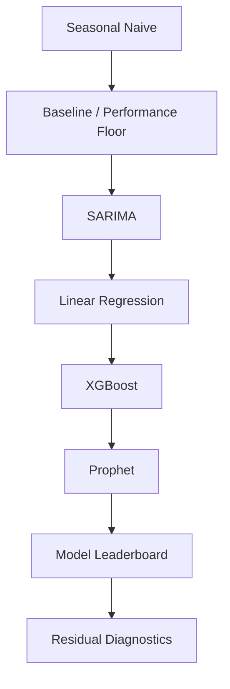
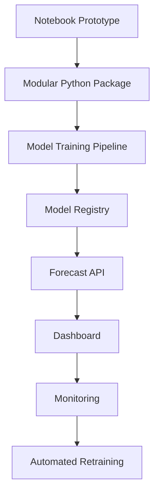

<div align="center">


<a href="https://git.io/typing-svg">
  
</a>

<br/>


<br/><br/>

<b>Hourly electricity demand forecasting using statistical modeling, machine learning, and professional time-series diagnostics.</b>

</div>

---

## 📌 Table of Contents

- [1. Project Summary](#-1-project-summary)
- [2. Business Problem](#-2-business-problem)
- [3. Dataset Overview](#-3-dataset-overview)
- [4. Notebook Preview](#-4-notebook-preview)
- [5. End-to-End Workflow](#-5-end-to-end-workflow)
- [6. Exploratory Data Analysis](#-6-exploratory-data-analysis)
- [7. Stationarity Testing](#-7-stationarity-testing)
- [8. Decomposition & Autocorrelation](#-8-decomposition--autocorrelation)
- [9. Feature Engineering](#-9-feature-engineering)
- [10. Modeling Strategy](#-10-modeling-strategy)
- [11. Model Leaderboard](#-11-model-leaderboard)
- [12. Best Model Deep Dive](#-12-best-model-deep-dive)
- [13. Residual Diagnostics](#-13-residual-diagnostics)
- [14. How to Run](#-14-how-to-run)
- [15. Repository Structure](#-15-repository-structure)
- [16. Tech Stack](#-16-tech-stack)
- [17. Key Learnings](#-17-key-learnings)
- [18. Limitations](#-18-limitations)
- [19. Future Improvements](#-19-future-improvements)

---

## 🚀 1. Project Summary

This project is a **professional-grade time series forecasting pipeline** built around Italy's 2016 hourly electricity grid data.

The main objective is to predict **national electricity load in megawatts (`load_mw`)** using a clean, explainable, and production-style forecasting workflow.

Instead of directly jumping into advanced models, this notebook follows the workflow used by real data scientists:


### ✅ Final Result

| Best Model | MAE | RMSE | MAPE |
|---|---:|---:|---:|
| **XGBoost Regressor** | **2,607 MW** | **3,654 MW** | **9.98%** |

<div align="center">


</div>

---

## 🎯 2. Business Problem

Electricity demand forecasting is one of the most important problems in the energy sector.

Grid operators, energy suppliers, and policy teams need accurate demand forecasts to make decisions such as:

| Business Area | Why Forecasting Matters |
|---|---|
| **Grid Operations** | Prevent under-supply and overload situations |
| **Energy Procurement** | Buy or generate the right amount of electricity |
| **Renewable Integration** | Balance solar generation with demand patterns |
| **Cost Optimization** | Reduce expensive emergency power purchases |
| **Infrastructure Planning** | Understand peak demand and seasonal behavior |
| **Policy & Sustainability** | Plan cleaner energy mix and grid reliability |

### Problem Statement

> Given historical hourly electricity load and solar generation data, build a forecasting pipeline that predicts future grid load accurately and explains the drivers behind the prediction.

### Target Variable

```text
load_mw = National electricity demand/load in megawatts
```

### Forecast Horizon Used

```text
Last 7 days of 2016 = 168 hourly predictions
```

---

## 🧾 3. Dataset Overview

The dataset contains hourly electricity data for Italy in 2016.

| Field | Description |
|---|---|
| `utc_timestamp` | Hourly timestamp |
| `load_mw` | Italy national electricity grid load in MW |
| `solar_mw` | Solar generation in MW |

### Dataset Shape

| Item | Value |
|---|---:|
| Rows | **8,784** |
| Columns used | **2** |
| Date Start | **2016-01-01 00:00:00** |
| Date End | **2016-12-31 23:00:00** |
| Frequency | **Hourly** |
| Missing values in `load_mw` before treatment | **72** |
| Missing values after interpolation | **0** |

### Descriptive Statistics

| Metric | `load_mw` | `solar_mw` |
|---|---:|---:|
| Count | 8,712 | 8,784 |
| Mean | 32,262 MW | 2,050 MW |
| Std | 7,289 MW | 2,846 MW |
| Min | 16,716 MW | 0 MW |
| Median | 31,654 MW | 68 MW |
| Max | 48,986 MW | 15,824 MW |

### Data Cleaning Decision

The notebook uses **time-based interpolation** for missing `load_mw` values.

Why this is better than simple forward fill:

- Electricity demand is continuous and smooth.
- Forward fill repeats stale values and can distort hourly cycles.
- Time interpolation estimates missing points using surrounding timestamps.
- It keeps the hourly cadence required by SARIMA and lag features.

---

## 🖼️ 4. Notebook Preview

> All images below are exported directly from the notebook outputs.

### 4.1 Exploratory Data Analysis Dashboard



### 4.2 Seasonal Decomposition



### 4.3 ACF and PACF Analysis



### 4.4 Chronological Train/Test Split



### 4.5 XGBoost Forecast



### 4.6 All Models vs Actual Load



### 4.7 Feature Importance and Residual Diagnostics



---

## 🧭 5. End-to-End Workflow

This project is organized like a real-world forecasting case study.

| Step | Stage | Purpose |
|---:|---|---|
| 0 | Install & Import Libraries | Prepare Python forecasting environment |
| 1 | Load & Parse Data | Convert timestamp into proper `DatetimeIndex` |
| 2 | Missing Value Handling | Use time interpolation for continuity |
| 3 | EDA | Understand trend, seasonality, peaks, and distributions |
| 4 | Stationarity Testing | Decide whether differencing is needed |
| 5 | Seasonal Decomposition | Split series into trend, seasonality, and residual |
| 6 | ACF/PACF | Guide SARIMA parameter selection |
| 7 | Train/Test Split | Hold out last 168 hours without shuffling |
| 8 | Seasonal Naive | Establish simple benchmark |
| 9 | SARIMA | Classical statistical forecasting benchmark |
| 10 | Feature Engineering | Build time-aware ML features |
| 11 | Linear Regression | Simple interpretable ML baseline |
| 12 | XGBoost | Non-linear high-performing ML model |
| 13 | Prophet | Additive forecasting framework |
| 14 | Leaderboard | Compare models using same test window |
| 15 | Diagnostics | Analyze feature importance and residual errors |

---

## 📊 6. Exploratory Data Analysis

EDA was performed before modeling to understand the structure of the time series.

### Key EDA Questions

| Question | Why It Matters |
|---|---|
| Is the hourly index continuous? | SARIMA and lag features require regular frequency |
| Are there missing values? | Missing values can break model training |
| What is the daily demand pattern? | Electricity demand often follows human activity cycles |
| What is the solar generation pattern? | Solar peaks around daylight hours |
| Are there monthly differences? | Energy usage often changes by season |
| Are there abnormal spikes/drops? | Outliers can distort RMSE and model behavior |

### EDA Findings

| Insight | Finding |
|---|---|
| Peak load hour | **18:00** |
| Peak solar generation hour | **11:00** |
| Demand cycle | Strong intraday pattern |
| Solar cycle | Clear daylight/noon-driven pattern |
| Missing load values | 72 values interpolated |

### Interpretation

- Electricity demand peaks in the evening, likely due to residential and commercial consumption overlap.
- Solar generation peaks before/around noon, which does not perfectly align with evening load peak.
- This mismatch is important for grid balancing and renewable planning.
- Strong daily and weekly cycles suggest lag features should perform well.

---

## 🔬 7. Stationarity Testing

Stationarity is important for ARIMA/SARIMA models because these models assume the statistical properties of the series are stable over time.

Two complementary tests were used:

| Test | Null Hypothesis | Good Result |
|---|---|---|
| **ADF Test** | Series is non-stationary | p-value < 0.05 |
| **KPSS Test** | Series is stationary | p-value > 0.05 |

### Test Results

| Test | Statistic | p-value | Verdict |
|---|---:|---:|---|
| ADF | -12.0144 | 0.000000 | Stationary |
| KPSS | 0.1966 | 0.1000 | Stationary |

### Decision

Both tests agree that the target series is stationary.

```text
ARIMA differencing parameter d = 0
```

This is why the SARIMA model uses:

```python
order = (2, 0, 1)
```

---

## 🔄 8. Decomposition & Autocorrelation

### Seasonal Decomposition

The series was decomposed using an additive model with weekly seasonality:

```python
period = 168  # 24 hours × 7 days
```

| Component | Meaning |
|---|---|
| Observed | Original load series |
| Trend | Long-term movement |
| Seasonal | Repeating weekly behavior |
| Residual | Remaining unexplained noise |

### ACF/PACF Interpretation

| Plot | Use | Finding |
|---|---|---|
| ACF | Helps identify MA order `q` | Pattern supports `q=1` |
| PACF | Helps identify AR order `p` | Cuts off around lag 2 → `p=2` |
| Seasonal spikes | Reveal seasonality | Spikes at 24, 48, 72 hours |

### SARIMA Order Selected

```python
SARIMA(2, 0, 1)(1, 1, 0, 24)
```

| Parameter | Meaning |
|---|---|
| `p=2` | Two autoregressive terms |
| `d=0` | No non-seasonal differencing |
| `q=1` | One moving-average term |
| `P=1` | One seasonal autoregressive term |
| `D=1` | One seasonal difference |
| `Q=0` | No seasonal moving-average term |
| `s=24` | Daily seasonal period |

---

## 🛠️ 9. Feature Engineering

Machine learning models do not automatically understand time. Therefore, the notebook converts the timestamp and historical load values into predictive features.

### Feature Matrix

```text
Feature matrix shape: 8,448 rows × 9 features
```

### Engineered Features

| Feature | Type | Purpose |
|---|---|---|
| `hour` | Calendar | Captures daily demand cycle |
| `dayofweek` | Calendar | Captures weekday/weekend behavior |
| `month` | Calendar | Captures seasonal/monthly changes |
| `is_weekend` | Calendar flag | Separates weekend load behavior |
| `lag_24h` | Lag | Same hour yesterday |
| `lag_48h` | Lag | Same hour two days ago |
| `lag_168h` | Lag | Same hour last week |
| `rolling_24h_mean` | Rolling | Recent daily demand level |
| `rolling_7d_mean` | Rolling | Weekly demand baseline |

### Leakage Prevention

This is a critical part of the project.

The notebook avoids data leakage by ensuring that lag and rolling features only use past values.

```python
f["lag_24h"] = s.shift(24)
f["lag_48h"] = s.shift(48)
f["lag_168h"] = s.shift(168)
f["rolling_24h_mean"] = s.shift(1).rolling(24).mean()
f["rolling_7d_mean"] = s.shift(1).rolling(168).mean()
```

Why this matters:

- The model should never see the future while training.
- Rolling features must be shifted before applying rolling mean.
- Chronological splitting is required for realistic forecasting.

---

## 🤖 10. Modeling Strategy

The notebook compares five forecasting approaches.



### 10.1 Seasonal Naive

Seasonal Naive predicts the same value as the same hour one week ago.

```text
Prediction at time t = value at time t - 168 hours
```

Why it is used:

- It is simple.
- It is difficult to beat if the series has strong weekly seasonality.
- It gives a minimum benchmark every serious model should beat.

### 10.2 SARIMA

SARIMA is a classical statistical forecasting model that captures autocorrelation and seasonality.

Configuration used:

```python
order=(2, 0, 1)
seasonal_order=(1, 1, 0, 24)
```

Why it is useful:

- Interpretable.
- Strong statistical baseline.
- Does not require manual feature engineering.

### 10.3 Linear Regression

Linear Regression uses the engineered calendar, lag, and rolling features.

Why it is useful:

- Fast and explainable.
- Good baseline for ML feature engineering.
- Coefficients can show directional relationships.

Top coefficient signals from the notebook:

| Feature | Coefficient |
|---|---:|
| `dayofweek` | -1009.1 |
| `is_weekend` | 386.7 |
| `hour` | 21.5 |
| `month` | -15.1 |
| `lag_168h` | 0.5 |
| `lag_24h` | 0.3 |

### 10.4 XGBoost

XGBoost is a gradient boosting model that learns non-linear relationships and feature interactions.

Hyperparameters used:

```python
XGBRegressor(
    n_estimators=400,
    max_depth=6,
    learning_rate=0.05,
    subsample=0.8,
    colsample_bytree=0.8,
    random_state=42,
    verbosity=0
)
```

Why it performed best:

- Captures non-linear demand patterns.
- Learns interactions between hour, weekday, weekend, and lag features.
- Handles structured tabular features very well.
- Works strongly on lag-based time-series forecasting problems.

### 10.5 Prophet

Prophet is an additive forecasting model that can model trend and multiple seasonalities.

Configuration used:

```python
yearly_seasonality=True
weekly_seasonality=True
daily_seasonality=True
seasonality_mode="additive"
changepoint_prior_scale=0.05
seasonality_prior_scale=10
```

Why it is included:

- Useful for interpretable trend/seasonality decomposition.
- Can handle holidays and changepoints.
- Often strong for business forecasting when seasonality is stable.

---

## 🏆 11. Model Leaderboard

All models were evaluated on the exact same holdout window: **last 168 hours of 2016**.

| Rank | Model | MAE | RMSE | MAPE |
|---:|---|---:|---:|---:|
| 🥇 | **XGBoost** | **2,607.12 MW** | **3,654.33 MW** | **9.98%** |
| 🥈 | SARIMA | 3,054.51 MW | 3,766.63 MW | 11.47% |
| 🥉 | Linear Regression | 3,111.32 MW | 4,237.66 MW | 12.33% |
| 4 | Seasonal Naive | 6,584.54 MW | 8,294.53 MW | 25.06% |
| 5 | Prophet | 8,442.83 MW | 9,066.89 MW | 32.87% |

### Metrics Explained

| Metric | Meaning | Best When |
|---|---|---|
| MAE | Average absolute error in MW | You want easy business interpretation |
| RMSE | Penalizes large errors more strongly | Spikes and large misses are costly |
| MAPE | Percentage error | You want scale-independent comparison |

### Metric Formulas

```text
MAE  = mean(|actual - prediction|)
RMSE = sqrt(mean((actual - prediction)^2))
MAPE = mean(|actual - prediction| / actual) × 100
```

---

## 🥇 12. Best Model Deep Dive

### Best Model: XGBoost Regressor

XGBoost achieved the lowest MAPE and best overall accuracy.

| Metric | Value |
|---|---:|
| MAE | 2,607 MW |
| RMSE | 3,654 MW |
| MAPE | 9.98% |

### Why XGBoost Won

XGBoost was able to combine multiple demand signals:

| Signal | Example Feature | Why It Helps |
|---|---|---|
| Daily cycle | `hour` | Captures morning/evening demand changes |
| Weekly cycle | `dayofweek`, `is_weekend` | Separates workday vs weekend demand |
| Historical memory | `lag_24h`, `lag_48h`, `lag_168h` | Uses recent and weekly repeated behavior |
| Local trend | `rolling_24h_mean`, `rolling_7d_mean` | Gives smoothed recent demand context |

### Practical Interpretation

A MAPE of **9.98%** means the model's average prediction error is roughly **10% of actual demand** on the final 7-day test window.

For a first professional forecasting pipeline without weather, holidays, or external demand drivers, this is a strong result.

---

## 🔍 13. Residual Diagnostics

After selecting XGBoost, the notebook checks residual behavior.

### Residual Summary

| Diagnostic | Value | Interpretation |
|---|---:|---|
| Residual mean | -1,946 MW | Model has some systematic bias |
| Residual std | 3,093 MW | Typical residual spread |
| Max error | 13,627 MW | Largest miss during test horizon |

### What Residual Mean Means

Residual was calculated as:

```text
residual = actual - prediction
```

A negative residual mean means the model tends to **over-predict** load on average during the test window.

### How to Improve Residual Bias

- Add holiday indicators for Christmas/New Year week.
- Add temperature/weather data.
- Use time-series cross-validation instead of a single holdout week.
- Tune XGBoost with Optuna.
- Add prediction intervals to quantify uncertainty.
- Try SARIMAX using solar/load-related exogenous features.

---

## ▶️ 14. How to Run

### 14.1 Clone Repository

```bash
git clone https://github.com/your-username/your-repo-name.git
cd your-repo-name
```

### 14.2 Create Virtual Environment

```bash
python -m venv .venv
```

Windows:

```bash
.venv\Scripts\activate
```

macOS / Linux:

```bash
source .venv/bin/activate
```

### 14.3 Install Dependencies

```bash
pip install -r requirements.txt
```

Or install manually:

```bash
pip install pandas numpy matplotlib seaborn statsmodels scikit-learn xgboost prophet jupyter
```

### 14.4 Required Files

Make sure these files are present in the repo root:

```text
TimeSeries_Professional_Pipeline.ipynb
TimeSeries_TotalSolarGen_and_Load_IT_2016.csv
```

### 14.5 Run Notebook

```bash
jupyter notebook TimeSeries_Professional_Pipeline.ipynb
```

Then run all cells from top to bottom.

---

## 📁 15. Repository Structure

```bash
.
├── README.md
├── requirements.txt
├── TimeSeries_Professional_Pipeline.ipynb
├── TimeSeries_TotalSolarGen_and_Load_IT_2016.csv
└── assets/
    ├── notebook_cell_08_0.png    # EDA dashboard
    ├── notebook_cell_12_0.png    # Decomposition plot
    ├── notebook_cell_14_0.png    # ACF/PACF plot
    ├── notebook_cell_16_1.png    # Train/test split
    ├── notebook_cell_18_0.png    # Seasonal naive forecast
    ├── notebook_cell_20_1.png    # SARIMA forecast
    ├── notebook_cell_24_0.png    # Linear regression forecast
    ├── notebook_cell_26_0.png    # XGBoost forecast
    ├── notebook_cell_28_1.png    # Prophet forecast
    ├── notebook_cell_31_0.png    # All models comparison
    └── notebook_cell_33_0.png    # Feature importance + residuals
```

---

## 🧰 16. Tech Stack

<div align="center">


<br/><br/>


</div>

---

## 💡 17. Key Learnings

This project demonstrates several important time-series forecasting principles.

| Principle | Explanation |
|---|---|
| Never shuffle time series | Future data must not leak into training |
| Always build a baseline | Advanced models must beat simple seasonal naive logic |
| Stationarity matters | ADF and KPSS help guide ARIMA/SARIMA differencing |
| Lag features are powerful | Yesterday and last-week demand strongly inform future load |
| Rolling features add trend context | Rolling means provide smoothed historical behavior |
| One holdout is not enough for production | TimeSeriesSplit or walk-forward validation is better |
| Residual diagnostics matter | Low MAPE alone is not enough; bias must be checked |

---

## ⚠️ 18. Limitations

Even though XGBoost performed best, this is still a notebook-level forecasting pipeline.

Current limitations:

- Uses only one year of data.
- Uses a single 7-day holdout split.
- Does not include weather data.
- Does not include Italian public holidays.
- Does not include economic/activity indicators.
- Does not tune hyperparameters using Optuna/GridSearch.
- Does not include prediction intervals.
- Prophet underperformed and may need holiday/custom seasonality tuning.
- Residual mean shows XGBoost has some bias during the test period.

---

## 🔮 19. Future Improvements

### Modeling Improvements

- Add **TimeSeriesSplit** or walk-forward validation.
- Tune XGBoost using **Optuna**.
- Train **LightGBM** and compare with XGBoost.
- Build **SARIMAX** with exogenous variables like solar generation and weather.
- Add **CatBoost** for robust tabular forecasting.
- Try deep learning models like:
  - LSTM
  - GRU
  - Temporal CNN
  - N-BEATS
  - Temporal Fusion Transformer

### Feature Improvements

- Add public holidays in Italy.
- Add temperature, humidity, wind speed, and cloud cover.
- Add cyclical encoding for hour/month:

```python
sin_hour = sin(2π × hour / 24)
cos_hour = cos(2π × hour / 24)
```

- Add solar-to-load ratio.
- Add peak-hour flags.
- Add working day / holiday bridge indicators.

### Deployment Improvements

- Convert notebook into modular Python scripts.
- Save trained model using `joblib`.
- Create Streamlit dashboard.
- Add API endpoint using FastAPI or Flask.
- Add model monitoring dashboard.
- Add automated retraining pipeline.

---

## 🧪 Example Production Roadmap



---

## 🧠 Interview-Ready Explanation

> I built an end-to-end time series forecasting pipeline to predict Italy's national grid load using hourly energy data. I started with data validation, timestamp parsing, missing value interpolation, and EDA to understand demand and solar generation cycles. Then I performed ADF and KPSS tests to check stationarity, used seasonal decomposition to understand trend and weekly seasonality, and applied ACF/PACF to guide SARIMA parameters. For modeling, I compared Seasonal Naive, SARIMA, Linear Regression, XGBoost, and Prophet on the same chronological 7-day holdout test set. XGBoost performed best with 9.98% MAPE because lag and rolling features captured strong daily and weekly demand patterns. Finally, I used feature importance and residual diagnostics to interpret the model and identify next improvements like weather, holidays, Optuna tuning, and walk-forward validation.

---

## 👨‍💻 Author

<div align="center">

### **Akshay Rathod**

Data Scientist | AI/ML Engineer | Time Series Forecasting | Energy Analytics

<a href="mailto:akshayrathod8179@gmail.com">
  
</a>
<a href="https://github.com/Akshay8087">
  
</a>
<a href="https://www.linkedin.com/">
  
</a>

</div>

---

## ⭐ Final Note

This project is designed to show more than model accuracy. It shows a complete professional thought process:

```text
Business Understanding → Data Quality → EDA → Statistical Testing → Forecasting Models → Evaluation → Explainability → Improvement Plan
```

<div align="center">


</div>
